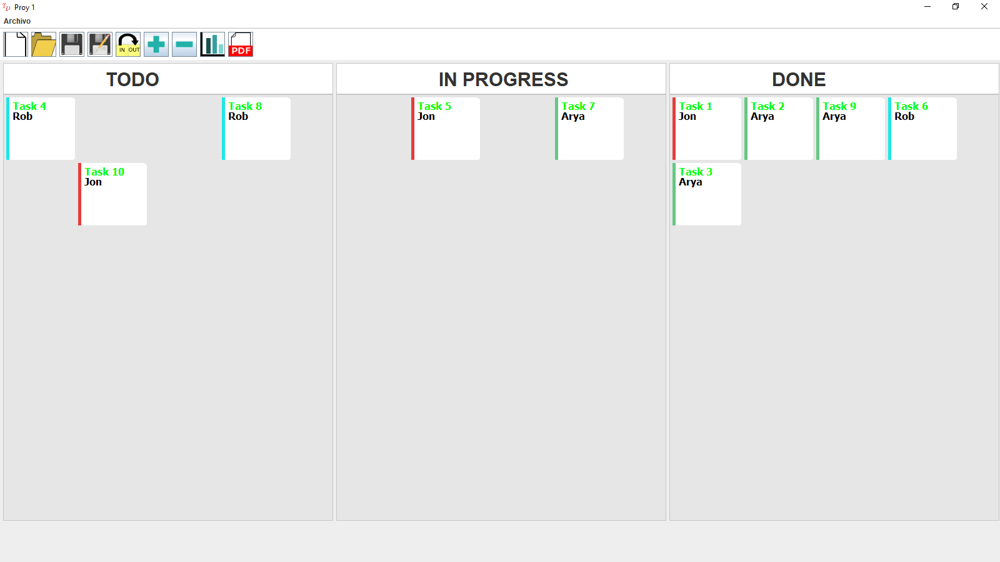
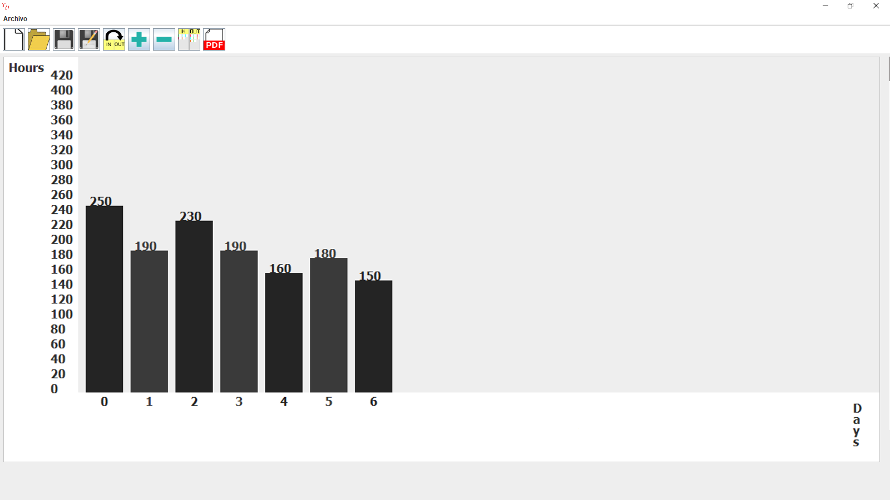

# Scrum #

This proyect is a virtual SCRUM program. (Obviously) |:D 

## It will have ##

-Account access.

-Different levels access:

 *    master : can see the progress from each worker, general view and change task assignations.
 
 *    worker : can see its own progress and general view.
 
-Two modes:

 *    Local  mode: it uses local files to fill the boards.

 *    Remote mode: connection to a data base to fill the boards.

-A personal chart for each 'worker' and a general one.

## How do I use it? ##

Try it downloading the '.jar' file in the 'Try' folder.

or

clone de proyect 

remove all the '.class' files (yes, i won't delete them for you! :P )

~~~
[Linux]$rm *.class    

$make

$java main
~~~

## by ##

***Brian A. Chacón***

## Conctacto ##

brian89.chacon89@gmail.com
